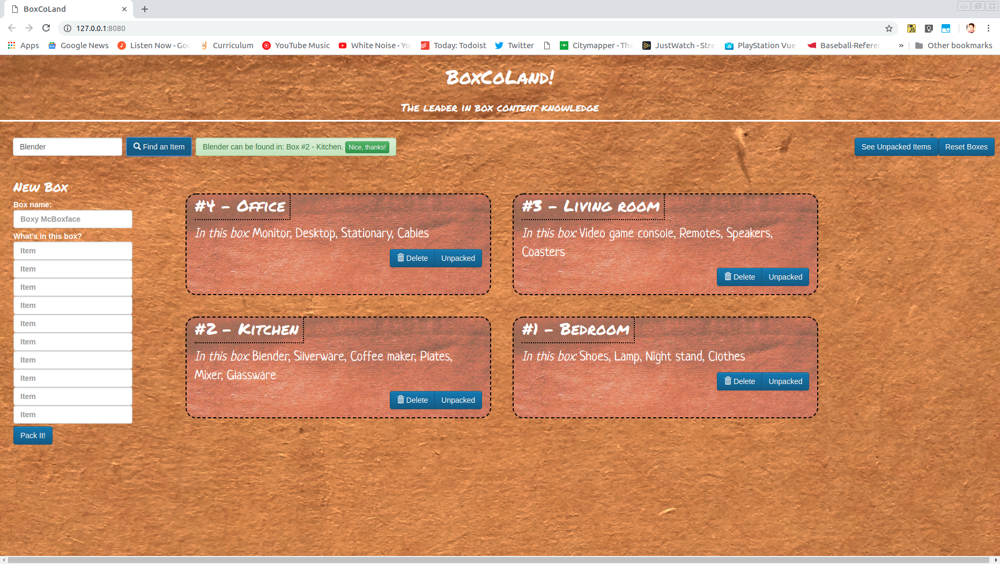
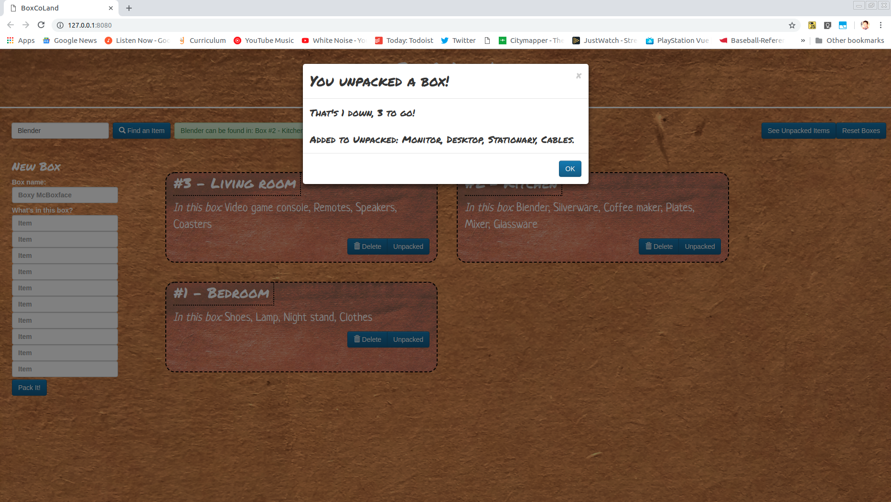

## **BoxCoLand v1.0.0**

BoxCoLand is a simple app made to help the user keep track of their stuff as they move.

User can create boxes corresponding to their real ones as they pack, search to easily find items, and track their unpacking progress.

https://drive.google.com/file/d/1tYTblXNmJ1c_qI5xtMfWzx-nB-bNgVnZ/view?usp=sharing

https://drive.google.com/file/d/1WZ3PtZY3Ze2e7cqH_dlpXNSyjsrnafsQ/view?usp=sharing

## Setup

BoxCoLand runs entirely in browser, and is free of charge. Access at http://axiomatic-bottle.surge.sh/. No installation is required, but it will use your browser's local storage to remember your progress. 

## How-to

Boxes are created as the user enters box names and contents on the left-hand form.

Searching for an item in the upper-left-hand box will return the boxes that item is found in, or let the user know if it's already been unpacked, or isn't present at all.

Clicking a box's "Unpacked" button will get rid of the box, but preserve its contents by adding them to an "Unpacked" list which can be displayed any time by clicking "See Unpacked Boxes". Deleting the box simply purges its data. 

Boxes and information are saved between sessions, and will populate any time the site is accessed. They're kept until "Reset Boxes" is pressed. 

